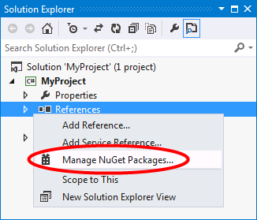

# Create Your NRack App

> __Keywords__: NRack, NRack App, AppServer

## Get NRack

The latest version of NRack is available as the [NRack NuGet package](https://www.nuget.org/packages/NRack/). If you are not familiar with the NuGet Package Manager, we encourage you to read the [NuGet Overview](http://docs.nuget.org/consume/overview).

### Installing the NRack NuGet Package

You can install the NRack package by right-clicking on the References folder of your project and selecting Manage NuGet Package...

### Installing from Package Manager Console

Alternatively, you can install NRack by running the following command in the [Package Manager Console](https://www.nuget.org/packages/NRack/).

	PM> Install-Package NRack

## Create Your NRack AppServer

Define a class base on the NRack AppServer base class, and implement some required methods.
And add an attribute AppServerMetadata with its identiry name. The identity name will be used in NRack configuration.

	using System;
	using System.Configuration;
	using NRack.Base;
	using NRack.Base.Config;
	using NRack.Base.Metadata;
	
	[AppServerMetadata("TestAppServer")]
    public class TestAppServer : AppServer
    {
        public override bool Start()
        {            
			// the start code	
            return true;
        }

        public override void Stop()
        {
			// the stop code	
        }
    }
	
	
	
## More Methods can be Overrided of NRack AppServer

Setup method for initializing code

		protected override bool Setup(IServerConfig config, ExportProvider exportProvider)
        {
            return true;
        }

OnPreStart method for the code to be executed before start

		protected override bool OnPreStart()
		{
			return true;
		}
		
OnStarted method for the code to be executed after start

		protected override bool OnStarted()
		{
			return true;
		}
		
OnPreStop method for the code to be executed before stop

		protected override bool OnPreStop()
		{
			return true;
		}
		
OnStopped method for the code to be executed after stop

		protected override bool OnStopped()
		{
			return true;
		}
		
CanBeRecycled method to return whether the app can be recycled now

		public override bool CanBeRecycled()
        {
            return true;
        }

## Deployment and Configuration

### Directory Structure

No matter how you build your projects and how to copy output assemblies, you need make sure the NRack is deployed in the below directory structure:

	D:> NRack
			- AppRoot
				- TestAppServer
					- NRack.Examples.TestApp.dll
			- Config
				- log4net.config
			- AnyLog.dll
			- AnyLog.Log4Net.dll
			- log4net.dll
			- NRack.Base.dll
			- NRack.Server.exe
			- NRack.Server.exe.config
			- NRack.Worker.exe
			- NRack.cmd
			- NRack.sh

### Configuration

	<?xml version="1.0" encoding="utf-8" ?>
	<configuration>
	  <configSections>
		<section name="nrack" type="NRack.Base.Configuration.NRackConfigSection, NRack.Base"/>
	  </configSections>
	  <appSettings>
		<add key="ServiceName" value="NRackService"/>
	  </appSettings>
	  <nrack>
		<servers>
		  <server name="TestApp"
				  type="TestAppServer">
		  </server>
		</servers>
	  </nrack>
	</configuration>
